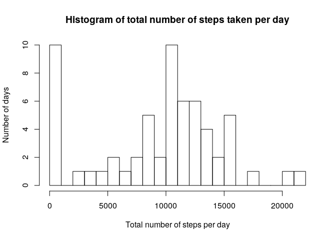
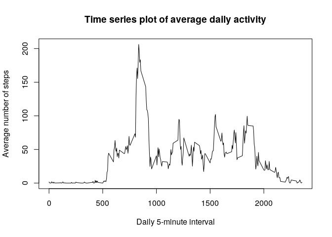
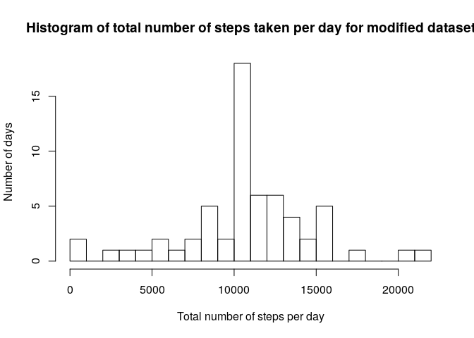
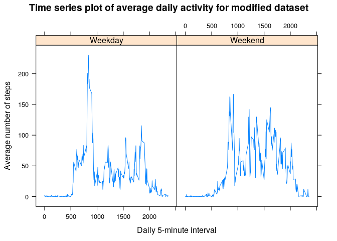

## Loading and preprocessing the data

#### Load the data


```r
# Unzip the data
unzip(zipfile = "activity.zip")
# Read the data
df <- read.csv("activity.csv")
```

#### Preprocess the data


```r
# Convert the 'date' column into 'Date' format
df$date <- as.Date(df$date)
# Look at the first 5 rows
head(df, 5)
```

```
##   steps       date interval
## 1    NA 2012-10-01        0
## 2    NA 2012-10-01        5
## 3    NA 2012-10-01       10
## 4    NA 2012-10-01       15
## 5    NA 2012-10-01       20
```


## What is mean total number of steps taken per day?

#### Load the packages


```r
# Import the 'dplyr' package
library(dplyr)
```

#### Calculate the total number of steps taken per day


```r
# Calculate the total number of steps grouped by date
df_tot <- df %>% group_by(date) %>% summarise(tot_steps = sum(steps, na.rm=TRUE))
```

#### Plot the histogram of total number of steps taken per day


```r
ttl <- "Histogram of total number of steps taken per day"
x_lab <- "Total number of steps per day"
y_lab <- "Number of days"
breaks <- seq(0, 22000, 1000)
hist(df_tot$tot_steps, breaks = breaks, main = ttl, xlab = x_lab, ylab = y_lab)
```

<!-- -->

#### Calculate the mean and median total number of steps taken per day


```r
# Mean total number of steps
print(paste0("Mean total number of steps are ", mean(df_tot$tot_steps)))
```

```
## [1] "Mean total number of steps are 9354.22950819672"
```

```r
# Median total number of steps
print(paste0("Median total number of steps are ", median(df_tot$tot_steps)))
```

```
## [1] "Median total number of steps are 10395"
```


## What is the average daily activity pattern?

#### Calculate the average daily activity


```r
# Calculate average number of steps taken for each 5-minute interval averaged across all days
df_5min <- df %>% group_by(interval) %>% summarise(avg_steps = mean(steps, na.rm=TRUE))
```

#### Generate the time series plot of the average daily activity


```r
ttl <- "Time series plot of average daily activity"
x_lab <- "Daily 5-minute interval"
y_lab <- "Average number of steps"
plot(df_5min$interval, df_5min$avg_steps, type = "l", main = ttl, xlab = x_lab, ylab = y_lab)
```

<!-- -->

#### Calculate the 5-minute interval containing the maximum average number of steps


```r
print(paste0("5-minute interval containing the maximum average number of steps is ", df_5min[which.max(df_5min$avg_steps), 'interval']))
```

```
## [1] "5-minute interval containing the maximum average number of steps is 835"
```


## Imputing missing values

#### Calculate the total number of missing values in the dataset


```r
print(paste0("Total number of missing values in the dataset are ", sum(is.na(df$steps))))
```

```
## [1] "Total number of missing values in the dataset are 2304"
```

#### Strategy for filling in all of the missing values in the dataset

Since, humans follow similar activity patterns with respect to the time of the day over different days, it is appropriate to substitute the missing data with the mean for that 5-minute time interval.

#### Create a new dataset with the missing data filled in


```r
# Copy the original dataset to a new dataframe
df_mod <- df
# Check and fill in the missing data
for(i in 1:nrow(df_mod)) {
  if(is.na(df_mod[i, 'steps'])) {
    df_mod[i, 'steps'] <- df_5min[df_mod[i, 'interval'] == df_5min$interval, 'avg_steps']
  }
}
```

#### Calculate the total number of steps taken per day for modified dataset


```r
# Calculate the total number of steps grouped by date
df_mod_tot <- df_mod %>% group_by(date) %>% summarise(tot_steps = sum(steps))
```

#### Plot the histogram of total number of steps taken per day for modified dataset


```r
ttl <- "Histogram of total number of steps taken per day for modified dataset"
x_lab <- "Total number of steps per day"
y_lab <- "Number of days"
breaks <- seq(0, 22000, 1000)
hist(df_mod_tot$tot_steps, breaks = breaks, main = ttl, xlab = x_lab, ylab = y_lab)
```

<!-- -->

#### Calculate the mean and median total number of steps taken per day for modified dataset


```r
# Mean total number of steps
print(paste0("Mean total number of steps for modified dataset are ", mean(df_mod_tot$tot_steps)))
```

```
## [1] "Mean total number of steps for modified dataset are 10766.1886792453"
```

```r
# Median total number of steps
print(paste0("Median total number of steps for modified dataset are ", median(df_mod_tot$tot_steps)))
```

```
## [1] "Median total number of steps for modified dataset are 10766.1886792453"
```

#### Impact of imputing missing data on the estimates of the total daily number of steps

It can be observed from the above histograms that the number of days for very low values and also high values of total number of steps per day have reduced and that for medium values have increased; particularly for the 10,000 to 11,000 total number of steps per day which has become the most prominent.


## Are there differences in activity patterns between weekdays and weekends?

#### Create a new factor variable for weekday/weekend


```r
# Copy the modified dataset to a new dataframe
df_mod_wd <- df_mod
# Check and designate weekday/weekend [where, weekend is either Saturday or Sunday]
for(i in 1:nrow(df_mod_wd)) {
  wds <- weekdays(df_mod_wd[i,'date'])
  df_mod_wd[i,'wd'] <- if_else((wds == "Saturday" || wds == "Sunday"), "Weekend", "Weekday")
}
df_mod_wd$wd <- as.factor(df_mod_wd$wd)
```

#### Calculate the average daily activity for modified dataset


```r
# Calculate average number of steps taken for each 5-minute interval averaged across all days
df_mod_5min <- df_mod_wd %>% group_by(wd, interval) %>% summarise(avg_steps = mean(steps, na.rm=TRUE))
```

#### Load the packages


```r
# Import the 'lattice' package
library(lattice)
```

#### Generate the time series plot of the average daily activity for modified dataset


```r
ttl <- "Time series plot of average daily activity for modified dataset"
x_lab <- "Daily 5-minute interval"
y_lab <- "Average number of steps"
xyplot(avg_steps ~ interval | wd, df_mod_5min, type = "l", main = ttl, xlab = x_lab, ylab = y_lab)
```

<!-- -->

#### Differences in activity patterns between weekdays and weekends

From the above graph, it is observed that the maximum value for the average number of steps is higher for weekdays over weekends. Moreover, during the weekends, there is an increase in the average number of steps for the latter 5-minute intervals/part of the day and hence, the activity has become more uniform over the day as compared to the weekdays.


## END
